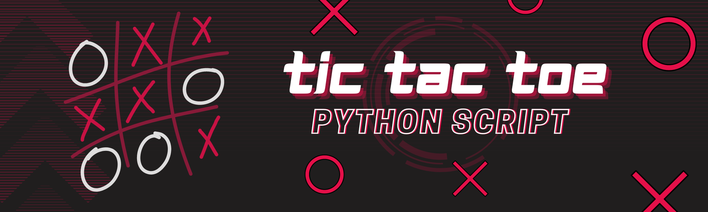

<div algin='center'>
    
</div>
<br>

# Tic-Tac-Toe Game
This is a simple Tic-Tac-Toe game played in the terminal. The game consists of two players who take turns marking the spaces in a 3x3 grid. The player who succeeds in placing three of their marks in a horizontal, vertical, or diagonal row wins the game.
<br>

# How to Play
* The game is played on a 3x3 board.
* One player chooses "X" and the other chooses "O".
* The "X" player always goes first.
* Players take turns making moves by placing one of their symbols in an empty space on the * board.
* The objective of the game is to place three of the same symbols in a row, column, or diagonal.
* The game ends when a player successfully completes a row, column, or diagonal with their symbols or when all the spaces on the board are filled.
* If no one is able to complete a row, column, or diagonal with their symbols, the game ends in a tie.
<br>

# Usage
* Make sure you have Python installed on your machine.
* Download the mod_ttt.py and tictactoe.py files from this repository.
* Open the terminal and navigate to the directory where you saved the files. 
```bash
cd tic-tac-toe
```
* Run the command "python tictactoe.py" to start the game.
```bash
python tictactoe.py
```
* Have fun playing Tic Tac Toe!
<br>

# License
This project is licensed under the MIT License - see the `LICENSE` file for details.